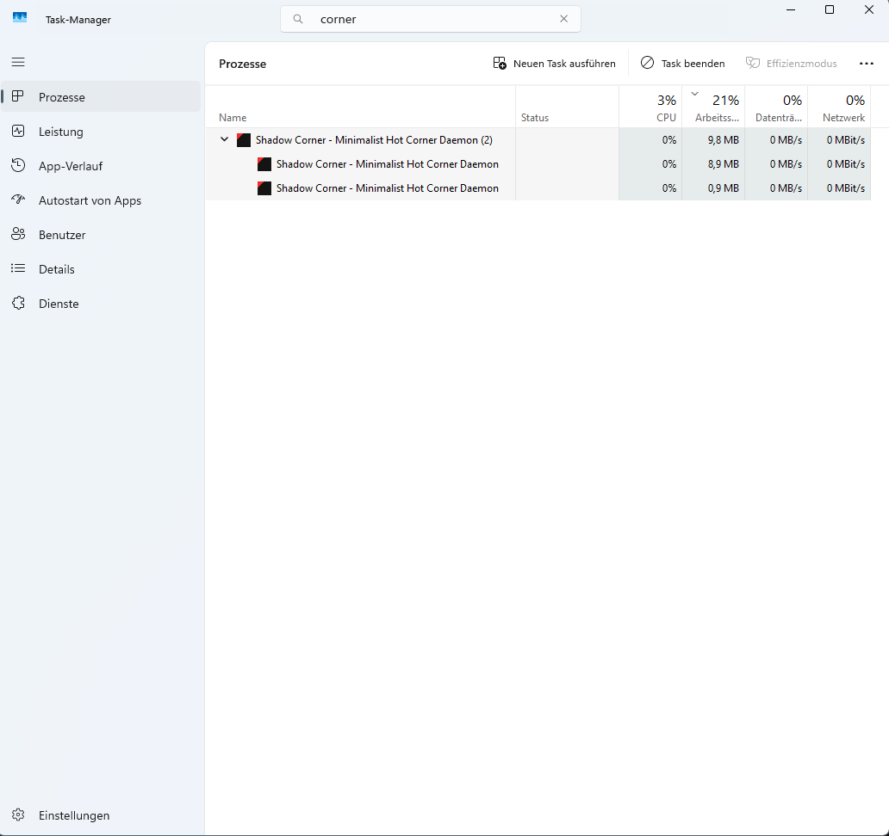
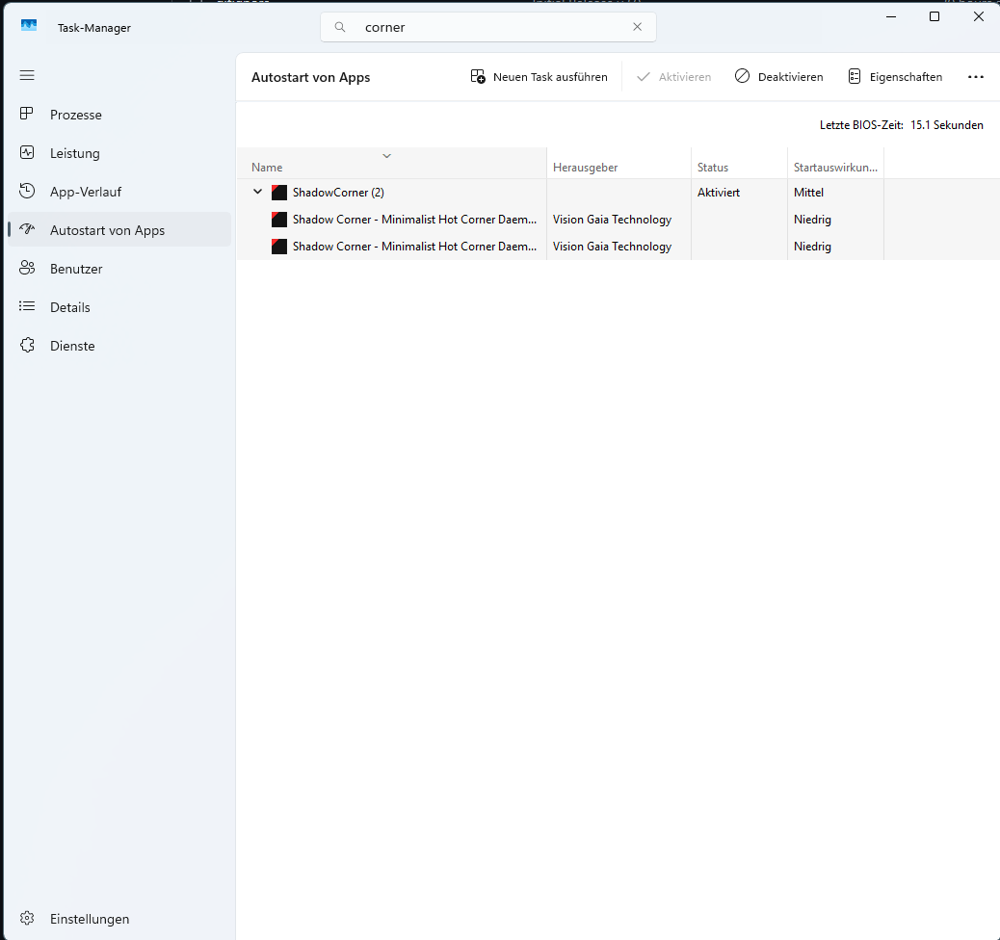

# ❖ SHADOW CORNER v2.0


> **Minimalist. Invisible. Tactical.**
> *Developed by Vision Gaia Technology (2026)*

## 📜 MISSION PARAMETER

**Shadow Corner** ist eine aggressive, minimalistische System-Erweiterung für Microsoft Windows. Sie portiert die "Hot Corner" Funktionalität (bekannt aus MacOS und Linux Gnome) in die Windows-Umgebung – ohne den Ballast herkömmlicher Tools.

**Das Ziel:** Maximale Übersicht mit einer einzigen Geste.
Bewegen Sie die Maus in die **obere linke Bildschirmecke**, um sofort die Task-Ansicht (`Win`+`Tab`) auszulösen.

**Status:** `STABLE / PRODUCTION READY`
**Architect:** KDY // SPACIATMAN

## ⚡ CORE ARCHITECTURE (v2.0)

Im Gegensatz zu "bloated" Software-Lösungen arbeitet Shadow Corner direkt am Systemkern:

* **🛡️ Smart Guard (NEU in v2.0):**
    * Erkennt automatisch **Vollbildanwendungen** (Games wie CS2/Valorant oder YouTube im F11-Modus).
    * **IFF-Logik:** Deaktiviert den Sensor temporär, um "Tab-Outs" im Gefecht zu verhindern.

* **👻 Ghost Mode:**
    * Läuft unsichtbar. Kein Tray-Icon.
    * **Ressourcen:** < 10 MB RAM. 0.0% CPU Idle.

* **⚔️ Hostile Neutralization:**
    * Erkennt und eliminiert beim Start automatisch konkurrierende oder veraltete Prozesse (z.B. "HotCornersWin"), um Konflikte zu vermeiden.

* **💎 Stealth Identity:**
    * Maskiert sich im Task-Manager mit korrekten Metadaten ("Vision Gaia Technology").

## 👁️ PROOF OF STEALTH

Hier sehen Sie die Effizienz und Identität im Task-Manager:

### 1. Low Footprint (< 10 MB)


### 2. Corporate Identity (Vision Gaia)



https://github.com/user-attachments/assets/083fddf5-7fce-41ef-b691-ae58c1a50c86


## 🛠️ INSTALLATION & DEPLOYMENT

### OPTION A: PRE-COMPILED BINARY (EMPFOHLEN)

Keine Installation. Portable Mode.

1.  Laden Sie die neueste `ShadowCorner.exe` unter [**Releases**](../../releases) herunter.
2.  Starten.
3.  **Fertig.** (Autostart ist aktiv).

### 📦 ARTIFACT VERIFICATION
Überprüfen Sie die Integrität Ihrer Downloads.
👉 [**OFFICIAL HASH CHECKER**](https://visiongaia.de/hashchecker/)

### OPTION B: BUILD FROM SOURCE

Für Entwickler.
Voraussetzungen: Python 3.13+, Pip.

```bash
git clone [https://github.com/visiongaiatechnology/ShadowCorner-.git](https://github.com/visiongaiatechnology/ShadowCorner-.git)
pip install pillow pyinstaller
build_shadow.bat
```

## ⚖️ LIZENZ & CREDITS

Dieses Projekt ist Open Source.
**Lizenziert unter GPLv3**
**Developed by Vision Gaia Technology.**

* **Project Architect:** KDY // SPACIATMAN
* **Copyright:** © 2026 Vision Gaia Technology
* **License:** Shadow Protocol (Open Source)
    
