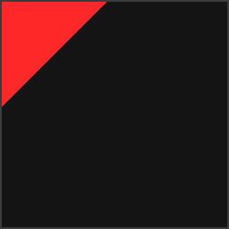
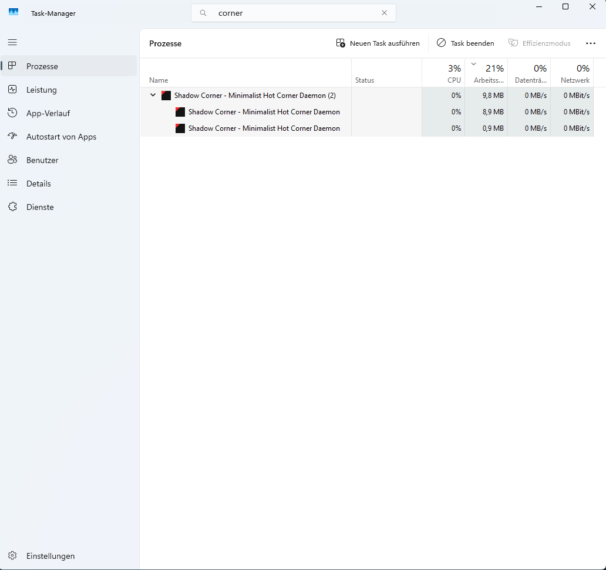
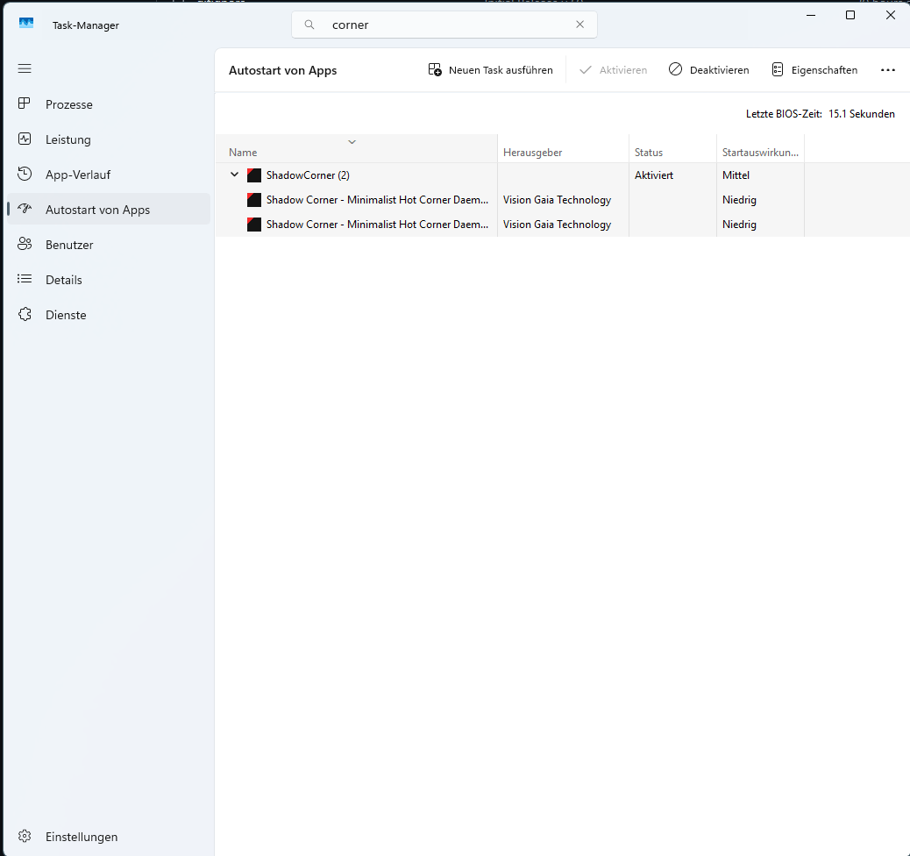

# ❖ ShadowCorner

[](LICENSE)
[](https://microsoft.com/windows)
[](https://python.org)
[](#)
[](https://visiongaiatechnology.de)
[](https://www.paypal.com/paypalme/dergoldenelotus)

> *"Minimalist. Invisible. Tactical."*

**ShadowCorner** ports the Hot Corner paradigm — known from macOS and Linux GNOME — into Windows. Move your mouse to the **top-left corner** of your screen and Task View fires instantly. No bloat. No tray icon. No compromise.

## ⚠️ DISCLAIMER: EXPERIMENTAL R&D PROJECT

This project is a **Proof of Concept (PoC)** and part of ongoing research and development at
VisionGaia Technology. It is **not** a certified or production-ready product.

**Use at your own risk.** The software may contain security vulnerabilities, bugs, or
unexpected behavior. It may break your environment if misconfigured or used improperly.

**Do not deploy in critical production environments** unless you have thoroughly audited
the code and understand the implications. For enterprise-grade, verified protection,
we recommend established and officially certified solutions.

Found a vulnerability or have an improvement? **Open an issue or contact us.**


---



---

## 🚨 The Problem with Windows Hot Corner Solutions

Every existing Windows Hot Corner tool is either abandoned, resource-heavy, or breaks during fullscreen applications — triggering accidental tab-outs in the middle of a game.

| Standard Solutions | ShadowCorner |
|---|---|
| ❌ Tray icons, settings panels, bloat | ✅ Ghost Mode — completely invisible |
| ❌ Triggers during fullscreen / games | ✅ Smart Guard — IFF detection, auto-disables |
| ❌ Conflicts with competing processes | ✅ Hostile Neutralization on startup |
| ❌ High RAM / CPU footprint | ✅ < 10 MB RAM. 0.0% CPU idle |
| ❌ Generic, unverified binaries | ✅ Signed identity + official hash checker |

---

## ⚡ Core Architecture

ShadowCorner operates directly at the system level — no UI framework overhead, no unnecessary abstractions.

### 🛡️ Smart Guard
Automatically detects fullscreen applications — games like CS2 or Valorant, or YouTube in F11 mode. The sensor disables itself during fullscreen to prevent accidental tab-outs. Re-enables the moment you exit.

### 👻 Ghost Mode
Runs completely invisible. No system tray icon. No window. No presence. Just behavior.

```
RAM Usage  : < 10 MB
CPU (Idle) : 0.0%
Tray Icon  : NONE
```

### ⚔️ Hostile Neutralization
On startup, ShadowCorner detects and terminates conflicting or outdated processes (e.g. `HotCornersWin`) to prevent behavioral conflicts — automatically, silently.

### 💎 Stealth Identity
Registers itself in Task Manager with correct metadata under **Vision Gaia Technology** — no anonymous or suspicious process entries.

---

## 👁️ Proof of Stealth

### Low Footprint (< 10 MB)


### Corporate Identity


### Live Demo
https://github.com/user-attachments/assets/083fddf5-7fce-41ef-b691-ae58c1a50c86

---

## 🚀 Installation

### Option A — Pre-Compiled Binary (Recommended)

No installation required. Fully portable.

1. Download the latest `ShadowCorner.exe` from [**Releases**](../../releases)
2. Run it
3. **Done.** Autostart is active immediately.

### 🔐 Artifact Verification

Always verify the integrity of your download before execution.

[](https://visiongaia.de/hashchecker/)

### Option B — Build from Source

For developers and auditors.

**Requirements:** Python 3.13+, Pip

```bash
# Clone the repository
git clone https://github.com/visiongaiatechnology/ShadowCorner-.git

# Install dependencies
pip install pillow pyinstaller

# Build
build_shadow.bat
```

---

## 📦 System Specs

```
TRIGGER         TOP-LEFT HOT CORNER
ACTION          WIN + TAB (Task View)
FULLSCREEN_IFF  SMART GUARD ACTIVE
PROCESS_GUARD   HOSTILE NEUTRALIZATION ON BOOT
FOOTPRINT       < 10 MB RAM / 0.0% CPU IDLE
AUTOSTART       ENABLED ON FIRST RUN
VISIBILITY      GHOST MODE (NO TRAY)
LICENSE         GPLv3
```

---

## 🤝 Contributing

Pull requests are welcome. For major changes, please open an issue first to discuss what you'd like to change.

Licensed under **GPLv3** — open source, auditable, free.

---

## ☕ Support the Project

ShadowCorner is free. If it improves your daily workflow:

[](https://www.paypal.com/paypalme/dergoldenelotus)

---

## 🏢 Built by VisionGaia Technology

[](https://visiongaiatechnology.de)

VisionGaia Technology builds enterprise-grade security and AI tooling — engineered to the DIAMANT VGT SUPREME standard.

**Project Architect:** KDY // SPACIATMAN
**Copyright:** © 2026 Vision Gaia Technology

> *"The best interface is the one you never see."*

---

*Version 2.0 — ShadowCorner // Ghost Mode Active*
